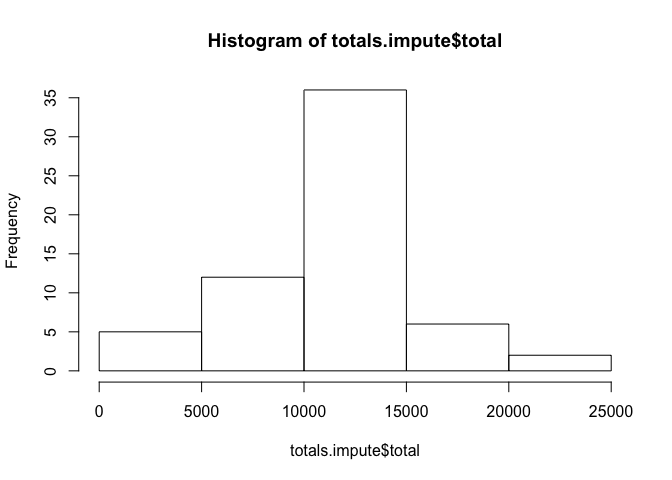

## Loading and preprocessing the data

```r
library(dplyr)
```

```
## 
## Attaching package: 'dplyr'
```

```
## The following objects are masked from 'package:stats':
## 
##     filter, lag
```

```
## The following objects are masked from 'package:base':
## 
##     intersect, setdiff, setequal, union
```

```r
library(lubridate)
```

```
## 
## Attaching package: 'lubridate'
```

```
## The following object is masked from 'package:base':
## 
##     date
```

```r
library(ggplot2)
activity <- read.csv("activity.csv", stringsAsFactors = FALSE)
activity <- mutate(activity, date = ymd(date))
```

```
## Warning in as.POSIXlt.POSIXct(x, tz): unknown timezone 'zone/tz/2017c.1.0/
## zoneinfo/America/Chicago'
```

## What is mean total number of steps taken per day?

```r
totals <- activity %>%
  group_by(date) %>%
  summarise(total = sum(steps, na.rm = TRUE))

hist(totals$total)
```

<!-- -->

```r
list(mean = mean(totals$total), median = median(totals$total))
```

```
## $mean
## [1] 9354.23
## 
## $median
## [1] 10395
```

## What is the average daily activity pattern?

```r
avgs <- activity %>%
  group_by(interval) %>%
  summarise(avg = mean(steps, na.rm = TRUE))

with(avgs, plot(interval, avg, type="l"))
```

<!-- -->

## Imputing missing values

```r
sum(is.na(activity$steps))
```

```
## [1] 2304
```

```r
avglookup <- avgs$avg
names(avglookup) <- avgs$interval
activity.impute <- mutate(activity, steps = ifelse(is.na(steps),
                                                   avglookup[as.character(interval)],
                                                   steps))

totals.impute <- activity.impute %>%
  group_by(date) %>%
  summarise(total = sum(steps, na.rm = TRUE))

hist(totals.impute$total)
```

<!-- -->

```r
list(mean = mean(totals.impute$total), median = median(totals.impute$total))
```

```
## $mean
## [1] 10766.19
## 
## $median
## [1] 10766.19
```


## Are there differences in activity patterns between weekdays and weekends?

```r
weekday.or.end <- function(date) {
  wdays <- weekdays(date)
  result <- ifelse(wdays == "Saturday" | wdays == "Sunday", "weekend", "weekday")
  factor(result, levels = c("weekday", "weekend"))
}

avgs.weekend <- activity %>%
  mutate(date = weekday.or.end(date)) %>%
  group_by(interval, date) %>%
  summarise(avg = mean(steps, na.rm = TRUE))

ggplot(avgs.weekend, aes(interval, avg)) +
  geom_line() +
  facet_grid(date ~ .)
```

<!-- -->
